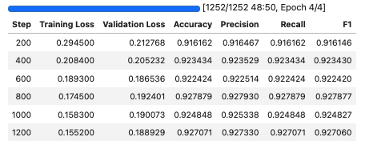
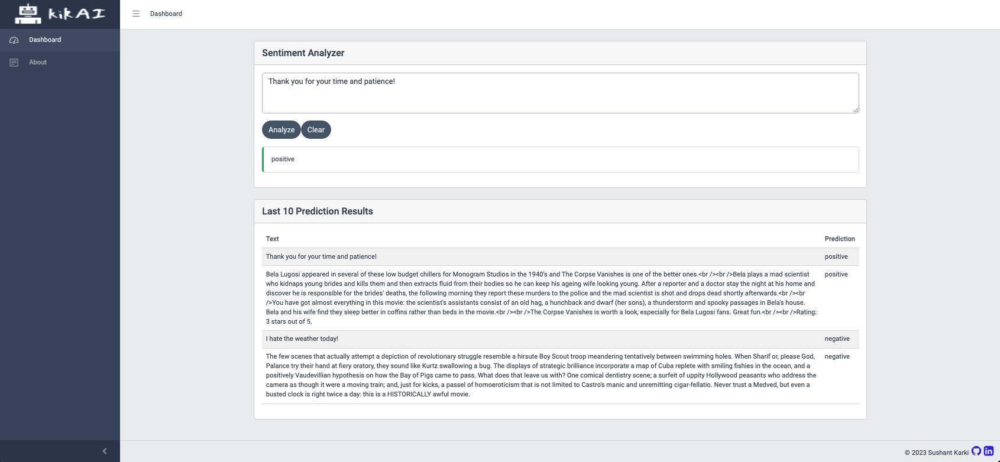

# Sentiment Classifier

## Implementation details:

- **Base Model:** [cardiffnlp/twitter-roberta-base-sentiment-latest](https://huggingface.co/cardiffnlp/twitter-roberta-base-sentiment-latest)
- **Dataset:** [IMDB Dataset of 50K Movie Reviews dataset](https://www.kaggle.com/datasets/lakshmi25npathi/imdb-dataset-of-50k-movie-reviews) from Kaggle
- **Number of epochs trained:** 4
- **Evaluation Metrics**:
  


## Optimization:

### Details:
- Used Optimum(Huggingface) to convert model to ONXX and used the ORTOptimizer to perform the following optimizations ([source](https://huggingface.co/docs/optimum/v1.6.4/onnxruntime/usage_guides/optimization)):
  - basic general optimizations
  - transformers-specific fusions
  - Gelu approximation
  - mixed precision

### Benchmark Results:
- Total samples for benchmarking: 50000
- Dataloader batch size: 32
- GPU: NVIDIA GeForce RTX 2080 Ti (11GB)


| Model | Latency (ms) |
|-------|---------|
| Original finetuned model |  151.81 &pm; 5.58 |
| Optimized model     |   **144.87 &pm; 1.96**     |


## Instructions:

### Training:
- Install Python requirements in `training/requirements.txt`
- Run the `training/notebooks/training-imdb.ipynb`

### Benchmark:
- Install Python requirements in `training/requirements.txt`
- Run the `training/notebooks/benchmark.ipynb`

### Running the live WEB UI demo:

**Prerequisites:** Docker, Docker Compose, make (optional)

*Perform the following inside the `web-app` directory*

**If you have make installed**
1. Build and run containers
    ```
    make up-dev
    ```
2. Open http://127.0.0.1:4200 in your browser (might take a few minutes for frontend to build assets)

**If make is not available**
1. Build images
```
docker build -f Dockerfile.backend -t sentiment-classification-backend ./backend
docker build -f Dockerfile.frontend -t sentiment-classification-frontend ./frontend
```
2. Run containers
```
docker-compose up -d
```
3. Open http://127.0.0.1:4200 in your browser (might take a few minutes for frontend to build assets)


